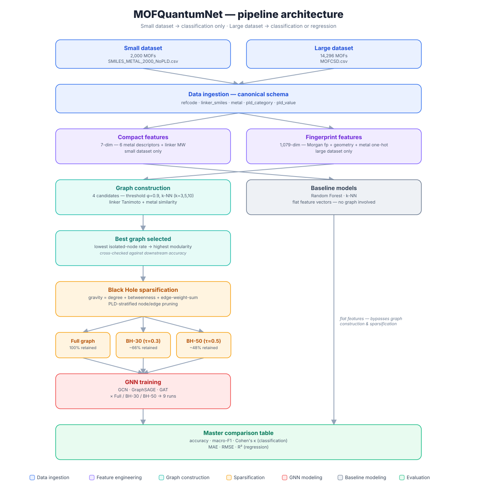

# MOFQuantumNet

Graph Neural Networks for predicting a Metal-Organic Framework's (MOF) Pore Limiting
Diameter (PLD) — the width of the narrowest constriction a molecule must pass through to
enter the pore. Builds on [MOFGalaxyNet](https://github.com/MehrdadJalali-AI/MOFGalaxyNet)
and the [Black Hole Strategy](https://github.com/MehrdadJalali-AI/BlackHole), reimplemented
in PyTorch Geometric with a generalized, dataset-agnostic pipeline and a web console for
predicting on new MOFs and exploring every pipeline stage live.

Case Study project for the Applied Data Science and Analytics program at SRH Hochschule
Heidelberg. Topic: **Graph Neural Networks for MOF Property Prediction**.

## Pipeline overview


<!-- Regenerate with: python pipeline_diagram.py -->

Each MOF is turned into a graph node; edges connect chemically similar MOFs (by linker
molecule and metal center). A Graph Neural Network passes messages along those edges to
predict PLD, either as one of four pore-size categories (classification) or as a continuous
value in Ångströms (regression).

1. **Data ingestion** (`src/data_ingestion.py`) — loads a MOF dataset into one canonical
   schema (`refcode`, `linker_smiles`, `metal`, `pld_category`, `pld_value`), regardless of
   which of the two source datasets is selected.
2. **Feature engineering** (`src/feature_engineering.py`) — turns each MOF's raw columns
   into a numeric feature vector per node: either a compact 7-dim descriptor or a 1,079-dim
   Morgan-fingerprint-based vector, depending on the dataset.
3. **Graph construction** (`src/graph_construction.py`) — builds 4 candidate similarity
   graphs (1 fixed-threshold, 3 k-NN variants) from linker Tanimoto similarity + metal
   similarity, and picks the one with the best connectivity/community structure.
4. **Black Hole sparsification** (`src/black_hole_sparsification.py`) — scores every node
   by a "gravity" metric (degree + betweenness centrality + edge-weight sum) and prunes the
   graph down to a configurable fraction of nodes/edges, stratified by PLD category so no
   class is wiped out.
5. **GNN training** (`src/gnn_training.py`) — trains GCN, GraphSAGE, and GAT on the full
   graph and on two sparsified variants, with a proper train/validation/test split.
6. **Baseline comparison** (`src/baseline_models.py`) — trains Random Forest and k-NN on
   the same flat feature vectors (no graph) as a sanity check on whether the graph structure
   is actually adding predictive value.
7. **Graph-selection trade-off check** (`src/graph_tradeoff_analysis.py`) — verifies
   Step 3's connectivity-based graph pick against actual downstream model accuracy, since
   the two aren't guaranteed to agree.

## Two datasets, one interface

| Dataset | Rows | Node features | Task |
|---|---|---|---|
| Small (`SMILES_METAL_2000_NoPLD.csv`) | 2,000 MOFs | Compact 7-dim (6 metal descriptors + linker molecular weight) | Classification only (no continuous PLD in this file) |
| Large (`MOFCSD.csv`) | 14,296 MOFs | Fingerprint 1,079-dim (1,024-bit Morgan fingerprint + 2 pore-geometry features + 53-way metal one-hot) | Classification or regression |

`src/data_ingestion.py::load_dataset(name)` returns both in the same canonical schema, and
`src/config.py::PipelineConfig` is the single switch point — everything else (feature
scheme, which tasks are available) cascades from the `dataset` choice.

## Setup

No conda — a plain `venv` is used throughout.

```bash
python3 -m venv .venv
source .venv/bin/activate
pip install -r requirements.txt
```

Requirements are unpinned (see `requirements.txt`) — PyTorch, PyTorch Geometric, RDKit,
pandas, NetworkX, scikit-learn, joblib, psutil, tqdm, matplotlib, FastAPI, and Uvicorn.

For development only (not needed to run the pipeline itself): `pip install -r
requirements-dev.txt`. Covers the API test client (`httpx`) and the test suite (`pytest`,
`hypothesis`, `mutmut`, `pytest-cov`).

## Usage

### Web console — Predict + Lab

A single FastAPI app serving both a JSON API and a static frontend — one process, one URL.
This is the primary way to use the project.

```bash
# 1. Train the models it serves (one-time, or after changing configuration)
.venv/bin/python -m webapp.backend.train_models --all   # baselines: ~5 min total, both datasets
.venv/bin/python -m webapp.backend.train_gnns --dataset small --task classification  # ~40s
.venv/bin/python -m webapp.backend.train_gnns --dataset large --task classification  # ~9 min
.venv/bin/python -m webapp.backend.train_gnns --dataset large --task regression       # ~9 min
# (large/regression GNNs optional — real minutes of compute; baselines alone work fine without them)

# 2. Run the app
.venv/bin/uvicorn webapp.backend.api:app --reload
# -> http://127.0.0.1:8000
```

Two surfaces, reachable from the left rail:

- **Predict** — describe a MOF (metal + linker SMILES, real or hypothetical) and every
  trained model answers, ranked by its own measured test accuracy. Graph models (GCN,
  GraphSAGE, GAT) are inserted into their trained similarity graph via nearest chemical
  neighbors before predicting — see `webapp/backend/inductive.py`. Any imputed input (e.g.
  no metal-identity column on the small dataset, no known pore geometry for a brand-new
  MOF on the large one) is flagged explicitly, never silently presented as equivalent to
  the benchmarked accuracy.
- **Lab** — all 7 pipeline stages computed live against the real backend, plus a
  **retrain form** (Black Hole Pruning step): adjust the gravity weights and pruning
  threshold, then retrain baselines and/or GNNs as a real background job, polled to
  completion in the browser — no terminal needed.

Architecture: `webapp/backend/` wraps `src/*.py` unchanged (train/persist/serve layers —
`model_store.py`, `gnn_store.py`, `inductive.py`, `jobs.py`); `webapp/frontend/` is plain
HTML/CSS/JS, no build step. Trained artifacts live in `webapp/models/` (gitignored,
regenerable via the two CLIs above). Full build history and design decisions:
[planning/DEVELOPMENT_TODO.md](planning/DEVELOPMENT_TODO.md) (Part 2).

### Pipeline scripts (standalone)

Each pipeline stage can also be run standalone — useful for regenerating
`outputs/`/`data/processed/` artifacts or debugging a specific stage in isolation.

```bash
.venv/bin/python src/data_ingestion.py              # EDA, plots to outputs/
.venv/bin/python src/feature_engineering.py         # builds + saves feature matrices to data/processed/
.venv/bin/python src/graph_construction.py          # builds all 4 graphs, saves edge lists + topology table
.venv/bin/python src/black_hole_sparsification.py   # sparsifies the best graph at tau=0.3 and tau=0.5
.venv/bin/python src/gnn_training.py                # trains GCN/GraphSAGE/GAT on all 3 graph variants
.venv/bin/python src/baseline_models.py             # RF + k-NN baselines + master comparison table
.venv/bin/python src/graph_tradeoff_analysis.py     # checks the graph-construction pick against downstream accuracy
```

### Pipeline architecture diagram

```bash
python pipeline_diagram.py
```

Writes `outputs/pipeline_architecture.svg` (the diagram at the top of this README) — a
plain script, no server or browser step needed. Regenerate after changing the pipeline's
stages or flow.

## Testing

```bash
pytest tests/ -q                                                     # everything, ~2min (includes real training/API smoke tests)
pytest tests/ -m "not slow" --cov=src --cov=webapp --cov-report=term-missing -q   # skip the 1 real-training smoke test, with coverage
mutmut run && mutmut results                                         # mutation testing (config.py + black_hole_sparsification.py)
```

Five layers under `tests/`: `unit/` (per-function correctness), `property/` (Hypothesis —
invariants across the full input space), `torture/` (extreme/degenerate inputs),
`acceptance/` (documented claims re-verified against the real data files), `webapp/` (the
FastAPI backend — model persistence round-trips, every endpoint, the full predict
leaderboard on live data, a real end-to-end retrain job). Full results, mutation-testing
detail, coverage breakdown, and every bug found:
[planning/QA_REPORT.md](planning/QA_REPORT.md).

## Project structure

```
pipeline_diagram.py                Generates outputs/pipeline_architecture.svg
src/
  config.py                       PipelineConfig — dataset is the one root switch; feature_scheme
                                   is derived from it; task, gravity weights, and pruning threshold
                                   are the other configurable fields
  data_ingestion.py                Loading, cleaning, EDA plots for both datasets
  feature_engineering.py           Compact / fingerprint node feature schemes
  graph_construction.py            Threshold vs. k-NN graph construction + topology metrics
  black_hole_sparsification.py     Gravity scoring + PLD-stratified node/edge pruning
  gnn_training.py                  GCN / GraphSAGE / GAT + train/eval with a proper 3-way split
  baseline_models.py               Random Forest / k-NN baselines + master comparison table
  graph_tradeoff_analysis.py       Graph-construction connectivity-vs-accuracy trade-off check
  logging_setup.py                 Shared logging configuration (-> outputs/pipeline.log)
webapp/                            Web console — Predict + Lab (see "Usage" above)
  backend/
    api.py                         FastAPI app — all routes, mounts frontend/ as static files
    model_store.py                 Trains/persists/loads baseline models (Random Forest, k-NN)
    gnn_store.py                   Trains/persists/loads GNN models (GCN, GraphSAGE, GAT)
    inductive.py                   Inserts a new MOF into a trained GNN's graph, runs one forward pass
    featurize.py                   Raw (metal, SMILES, ...) -> feature vector for a single new MOF
    lab.py                         In-process cache for pipeline objects shared across endpoints
    jobs.py                        Minimal background job runner, backs the Lab's retrain button
    train_models.py / train_gnns.py  CLIs to (re)build persisted artifacts
  frontend/
    index.html / app.js            No build step — plain fetch() against the API above
  models/                          Trained artifacts (gitignored — regenerate via the CLIs)
data/
  raw/                             Input datasets (both, including the large MOFCSD.csv)
  processed/                       Saved feature matrices, graph edge lists, topology tables, results
outputs/                           Generated plots, logs, architecture diagram (SVG)
tests/
  conftest.py                      Shared fixtures (synthetic dataset builders, tiny_graph, etc.)
  unit/                            Per-function correctness tests, one file per src/ module
  property/                        Hypothesis property-based tests — invariants across the full input space
  torture/                         Extreme/degenerate-input tests
  acceptance/                      Documented claims re-verified against the real data files
  webapp/                          FastAPI backend tests (endpoints, persistence, live predict/retrain)
planning/
  DEVELOPMENT_TODO.md               Development checklist, findings, decisions log — both the pipeline and the webapp
  CASE_STUDY_REPORT.md              Final written report — background, methodology, results, discussion, thesis extension
  QA_REPORT.md                      Full test/mutation/coverage results and every bug found
  PROJECT_OVERVIEW.md               Plain-language project explainer (no technical background assumed)
  PPT_PROMPT.md                     Slide-by-slide prompts for generating a presentation deck
```

## Key implementation decisions

- **Target leakage removed**: the source pipeline includes the raw Pore Limiting Diameter
  value as an input feature — but that's exactly what both the classification label and the
  regression target are derived from. Excluded here regardless of task
  (`src/feature_engineering.py`).
- **Proper train/validation/test split**: the source training loop reuses the test set for
  early-stopping validation. `src/gnn_training.py` keeps a genuine 3-way split — the fixed
  test nodes from Black Hole sparsification stay untouched until final evaluation; a
  separate validation split drives early stopping.
- **Generalized metal encoding**: the source pipeline hardcodes a 4-slot metal one-hot
  (Cu/Zn/Fe/Co), silently mis-encoding anything else as Cu. The large dataset has 53 unique
  metals — encoded with a full dynamic one-hot instead.
- **Equal gravity weighting by default**: Black Hole's gravity score combines degree
  centrality, betweenness centrality, and edge-weight sum. The default here is
  0.33/0.33/0.33 (equal weighting), matching the source paper's stated main configuration
  — all three weights are independently adjustable via the web console's retrain form.
- **k-NN vs. fixed similarity threshold**: a fixed threshold (φ=0.9) leaves 20.5% (small
  dataset) / 11.3% (large dataset) of nodes with no edges at all; every k-NN configuration
  guarantees 0% isolated nodes by construction, since every node gets its k nearest
  neighbors regardless of absolute similarity.
- **Deterministic invalid-SMILES handling**: an unparseable linker SMILES string produces a
  fixed all-zero feature vector, not random noise — repeated runs on the same data are
  reproducible.
- **Topology-only graph selection was checked against real accuracy**: picking a graph by
  connectivity/modularity alone doesn't always pick the best-*performing* graph —
  `src/graph_tradeoff_analysis.py` trains one model per graph candidate to check. Correct on
  the small dataset; on the large dataset, two of the k-NN variants beat the
  connectivity-selected pick on accuracy.
- **Non-graph baselines outperform every GNN configuration** on both tasks, on both
  datasets. The graph is built from the same linker/metal similarity that's already encoded
  in the node features, so message passing mostly re-derives information the model already
  has rather than adding new signal. Full reasoning and numbers:
  [planning/CASE_STUDY_REPORT.md](planning/CASE_STUDY_REPORT.md).
- **A brand-new MOF's GNN prediction is honestly caveated, not glossed over**: since the
  GNNs were trained transductively over a fixed graph, predicting on a MOF the graph has
  never seen requires inserting it via its nearest chemical neighbors
  (`webapp/backend/inductive.py`) — every graph-model prediction reports
  `graph_variant`/`n_neighbors_found` so this is visible, not a black box. Similarly, a
  prediction missing real pore-geometry or metal-identity data falls back to dataset
  medians and is flagged (`used_median_geometry` / `used_median_metal_feat`), rather than
  silently claiming the benchmarked accuracy applies.
- **Streamlit was removed once the web console reached parity.** The project originally had
  an interactive Streamlit control panel for live pipeline exploration; once `webapp/`
  covered both predicting and viewing every pipeline stage, keeping a second UI was extra
  surface with no remaining unique value, so it (and its dependency) was removed entirely
  rather than kept alongside the console.
